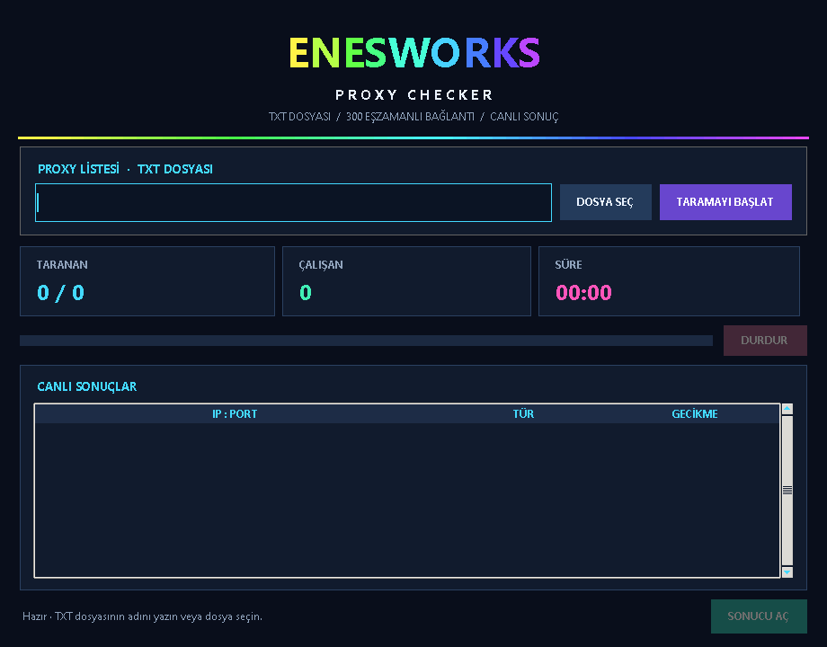

# ENESWORKS Proxy Checker

A small desktop app for checking IPv4 proxies from a text file. It shows scan progress and responsive proxies in a dark Tkinter window, then saves successful addresses to the Desktop.



## Features

- Animated RGB `ENESWORKS` header and live scan progress.
- Select a `.txt` file with the file picker, enter its name, or paste its full path.
- Check HTTP, SOCKS4, and SOCKS5 proxies. When a line has no scheme, the app tries each supported protocol.
- Run up to 300 checks at once.
- Save successful proxies as `ip:port` in a timestamped Desktop file.
- Stop a scan and save results collected so far.

## Requirements

- Python 3.10 or newer
- Tkinter (included with most Windows Python installations)

Install the network packages:

```bash
python -m pip install -r requirements.txt
```

## Run

```bash
python proxy_checker.py
```

Enter a file name such as `proxies.txt`, paste a full path, or click **DOSYA SEÇ**. The app searches your user folder when you enter only a file name.

To run a scan from the command line instead:

```bash
python proxy_checker.py --file "C:\Users\YourName\Desktop\proxies.txt"
```

## Input format

Put one proxy on each line. Supported examples:

```text
socks5://IP:PORT
socks4://IP:PORT
http://IP:PORT
IP:PORT
```

The app checks that the test service returns HTTP 200 with a valid IP response. The output file contains only `ip:port` lines; the app detects the proxy type again when it reads those lines later. A proxy can go offline or behave differently with other sites, so results describe the time and target used for that scan.

Do not commit personal proxy lists or generated result files to the repository.

## License

This project is licensed under the MIT License. See [LICENSE](LICENSE).
